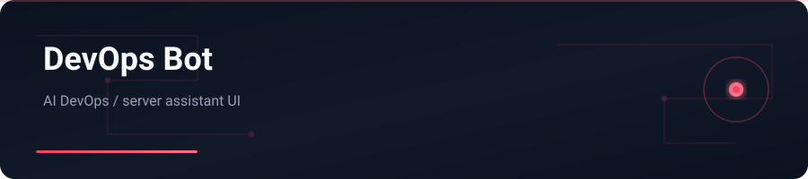

<div align="center">



</div>

# DevOps Bot

HTML-based AI assistant UI specialized for DevOps and server topics — becomes useful once you add your AI API key.

---

## English


### Features

- Single HTML client for an AI DevOps assistant
- Configure API credentials in the UI settings
- Focused on server / DevOps Q&A workflows

### Stack

HTML · JavaScript · AI API

### Getting started

```bash
git clone https://github.com/yasinfallahati/devaps-bot-.git
cd devaps-bot-
# open "devaps bot.html" in a browser and set your API key
```

---

## فارسی

### ربات دواپس

رابط HTML دستیار هوش مصنوعی متخصص دواپس و سرور — با افزودن API فعال می‌شود.


### امکانات

- کلاینت HTML برای دستیار AI دواپس
- تنظیم API در بخش تنظیمات
- متمرکز بر پرسش‌وپاسخ سرور و DevOps

### تکنولوژی‌ها

HTML · JavaScript · AI API

### شروع کار

```bash
git clone https://github.com/yasinfallahati/devaps-bot-.git
cd devaps-bot-
# فایل «devaps bot.html» را باز کنید و API را تنظیم کنید
```

---

`#devops` `#ai` `#html` `#assistant` `#server`
