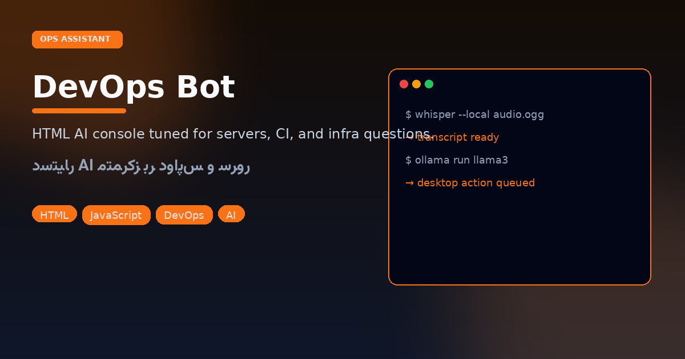
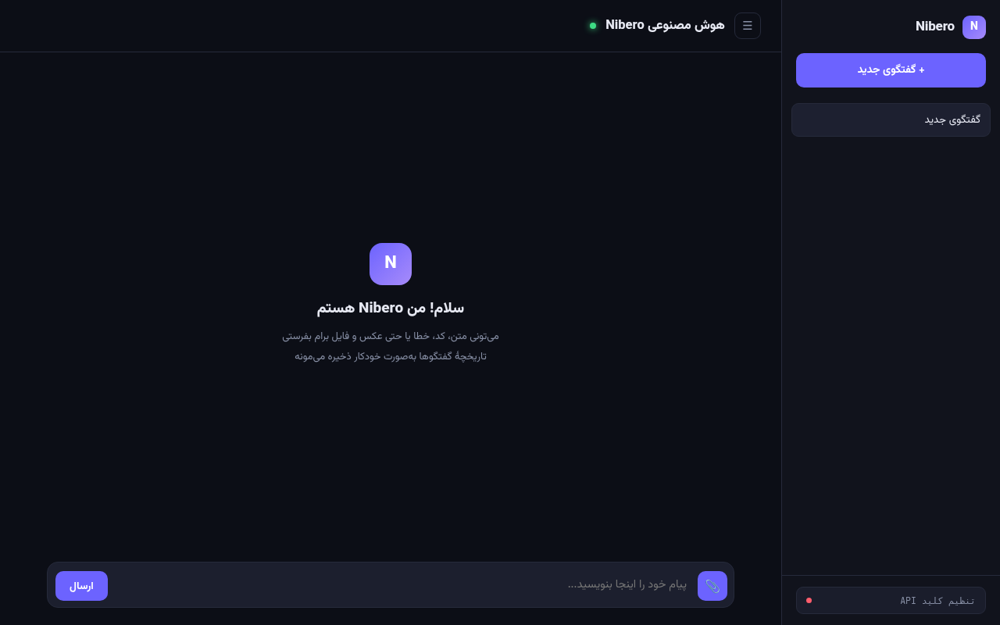

```
┌─────────────────────────────────────────┐
│  $ devops-assistant --topic servers     │
│  > CI · nginx · systemd · cloud trails  │
└─────────────────────────────────────────┘
```

<p align="center"></p>
<p align="center"></p>

# DevOps Bot

<p align="center">


</p>

A single HTML AI console **biased toward infrastructure questions** — systemd, reverse proxies, CI, cloud ops — once you supply your own model API key.

## Launch

```bash
xdg-open "devaps bot.html"
# or serve:
python3 -m http.server 8090
```

Open the file, set the key in the UI, ask about the incident you’re debugging.

---

## فارسی — ربات دواپس

دستیار AI مبتنی بر HTML با تمرکز موضوعی روی **سرور، CI و زیرساخت**. تا وقتی کلید API خودتان را نگذارید، فقط یک پوسته است؛ بعد از تنظیم، برای عیب‌یابی سریع روی لپ‌تاپ مفید می‌شود.

### اجرا

فایل «`devaps bot.html`» را در مرورگر باز کنید و کلید را تنظیم کنید.

### مخاطب

مهندسان و علاقه‌مندانی که می‌خواهند یک چت‌باکس سبکِ «devops-flavored» بدون نصب سنگین داشته باشند — نه جایگزین runbook رسمی تیم.
